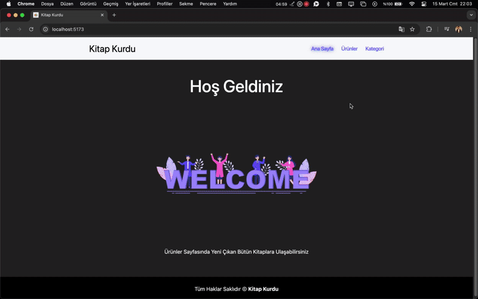

# 📚 Kitap Kurdu

Kitap Kurdu, React kullanılarak geliştirilmiş bir kitap listeleme ve detay görüntüleme uygulamasıdır.
Kullanıcılar kitapları sıralayabilir, arama yapabilir ve kitap detaylarını inceleyebilir. Fake bir API (db.json) kullanılarak veriler yönetilmektedir.

# 🚀 Projenin Özellikleri

- **Ana Sayfa**: Proje başlatıldığında ana sayfa görüntülenir.
- **Ürünler Sayfası**: Kitaplar liste halinde görüntülenir.
- **Arama Özelliği**: Arama çubuğu ile belirli kitapları arayabilirsiniz.
- **Kitap Detayları**: Kitap kartındaki "Detayı Gör" butonuna tıklanarak detay sayfasına gidilir.
- **Kitap detaylarında aşağıdaki bilgiler yer alır**:
- Kitap başlığı
- Yazar
- Çıkış yılı
- Sayfa sayısı
- Fiyat
- Özet

- **Kategori Sayfası**
  Sonradan eklenen özellik **Hikaye Kitapları** ve **Roman Kitapları** butonları aracılığıyla geçiş yapılabilir.
- **Hikaye Kitapları**: Hikaye türündeki kitaplar bir sayfada toplanır.
- **Roman Kitapları**: Roman türündeki kitaplar başka bir sayfada toplanır.

# 🎗️ 3 farklı listeleme seçeneği:

- Varsayılan (karışık)
- A-Z (alfabetik artan)
- Z-A (alfabetik azalan)

# ☠️ Hata Mesajları:

- api'dan hatalı veri gelir ve geçersiz bir sayfaya gidildiğinde hata mesajı gösterilir
- Kullanıcıyı ana sayfaya yönlendiren bir buton bulunmaktadır.
- Aranan kitap bulunamadığında(**Listede olmayan kitap**) Hata mesajı verir.

# 📷 2 adet ekran görüntüsü vardır

# 1-) Ana sayfa, özellikler

## 2-) Kategori sayfası

# 3-) Hata Mesajı

(**bu özelliği gösterebilmekmek için elle müdahele ettim 💪🏻**)

